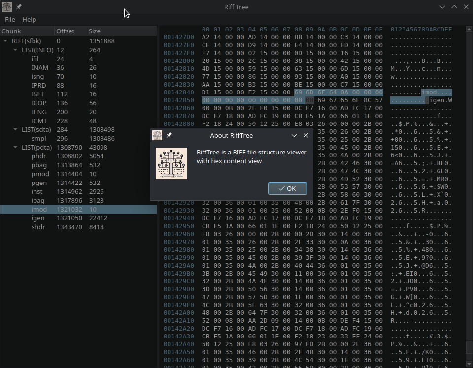

# RiffTreeGUI
A GUI application to show the tree structure of a [RIFF file](https://en.wikipedia.org/wiki/Resource_Interchange_File_Format).

This has been possible thanks to the following projects:

* [rifftree](https://github.com/jesustorresdev/rifftree) (Apache 2.0 license)
* [QHexView](https://github.com/Dax89/QHexView) (MIT license)

## Screenshot

## License

Copyright (C) 2025 Pedro López-Cabanillas  
SPDX-License-Identifier:  GPL-3.0-or-later
