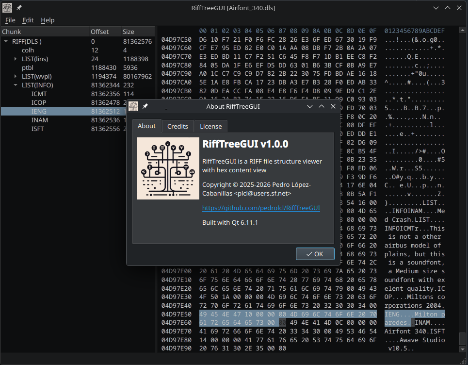

# RiffTreeGUI
A GUI application to show the tree structure of a [RIFF file](https://en.wikipedia.org/wiki/Resource_Interchange_File_Format) with hex view.
 
  
  
  
   

This is a Qt5/Qt6 GUI application showing the tree structure of a RIFF file with an hex view. Instead of reading and parsing the whole file (which may be quite large), it is memory mapped and should be very efficient.

## Common RIFF file types

* AVI (Windows audiovisual)
* WAV (Windows audio)
* RMI (Windows RIFF MIDI file)
* CDR (CorelDRAW vector graphics file)
* ANI (Animated Windows cursors)
* PAL (Palette)
* DLS (Downloadable Sounds)
* SF2 (SoundFont version 2, storing instrument samples)
* WebP (An image format developed by Google)

## Credits

This has been possible thanks to the following projects:

* [rifftree](https://github.com/jesustorresdev/rifftree) (Apache 2.0 license)
* [QHexView](https://github.com/Dax89/QHexView) (MIT license)

## Screenshot

## License

Copyright (C) 2025-2026 Pedro López-Cabanillas  
SPDX-License-Identifier: GPL-3.0-or-later
